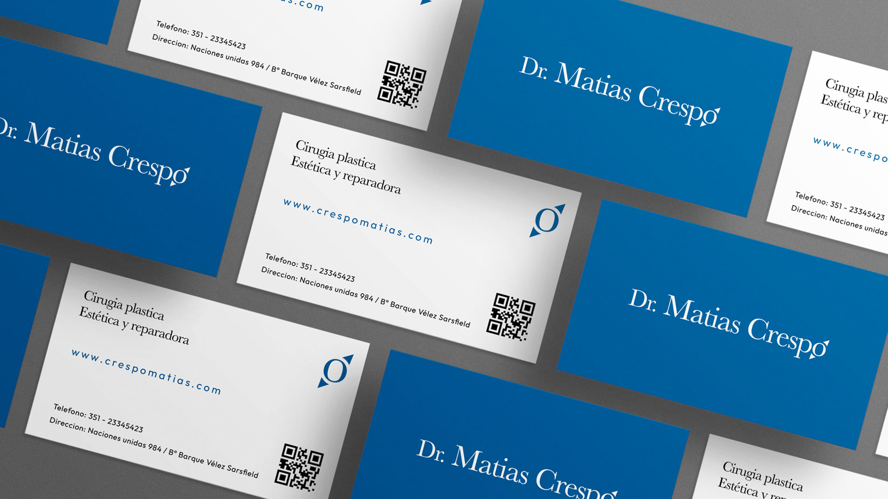
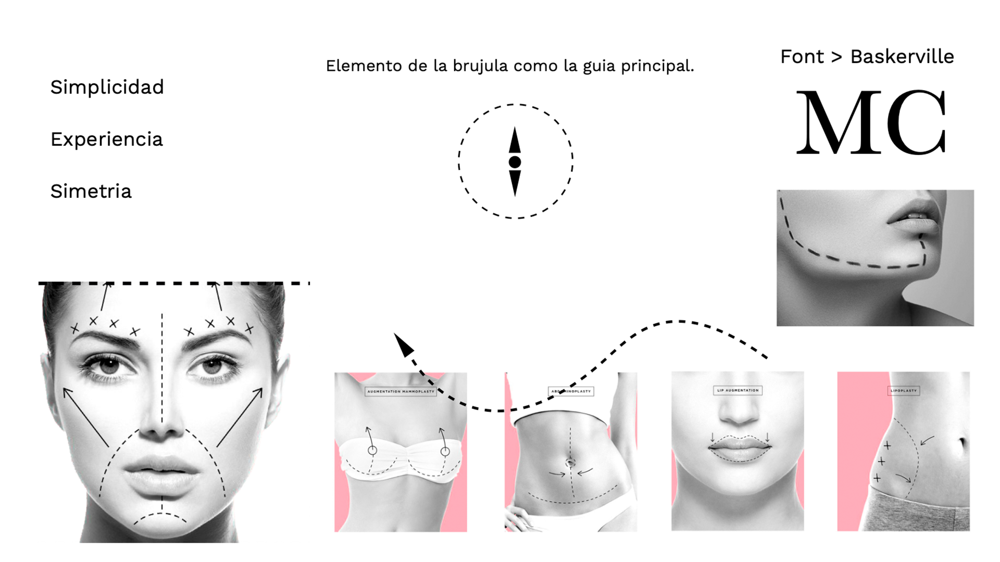
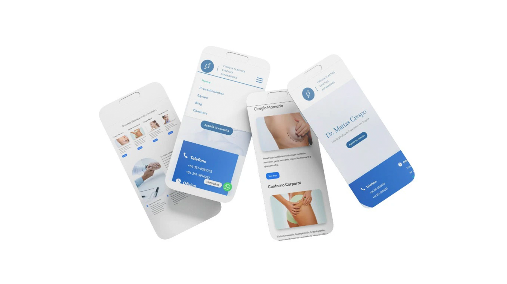
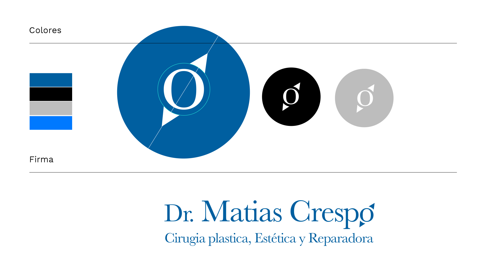
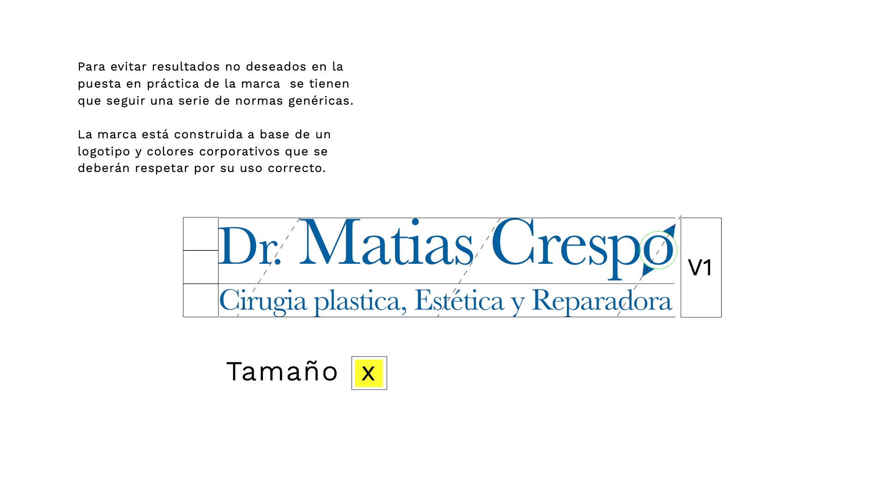
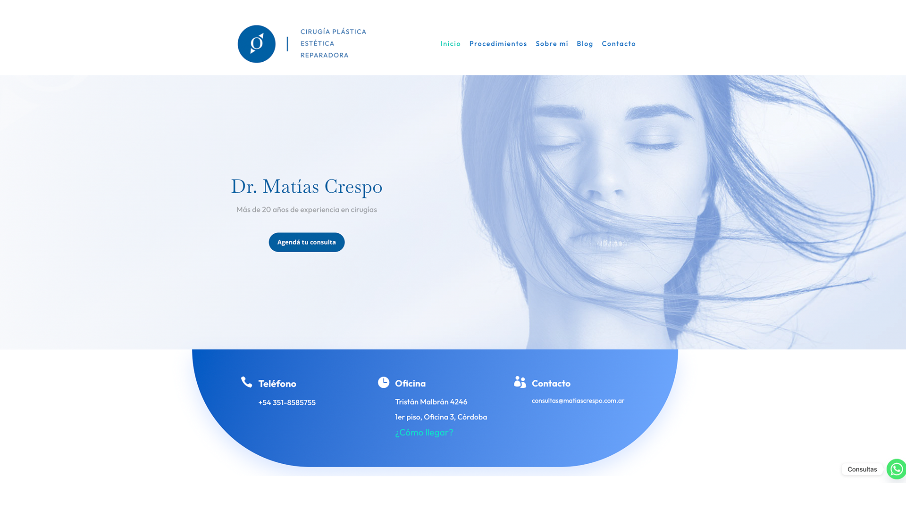

## Diagnostic

Dr. Matías Crespo had a name and the will to build a practice. No brand, no logo, no website, no content, no structure. In a trust-sensitive field like healthcare, that gap is the real problem: patients decide who to trust before they ever book.

## Decision

Start from the patient's decision, not from the logo. I defined the information architecture first: what a new patient needs to see, in what order, to feel safe enough to get in touch. Only then did the visual identity follow.

## Result

A complete system built from zero: logo, brand manual, typography, color palette and a live website on WordPress, all delivered end to end by one person.

## Gallery

[matiascrespo.com.ar](https://matiascrespo.com.ar)
